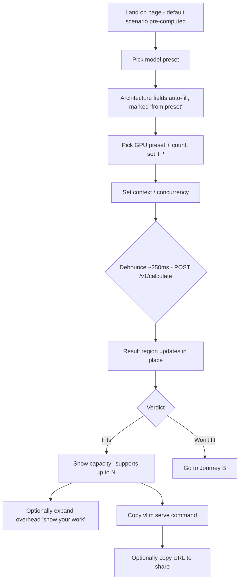
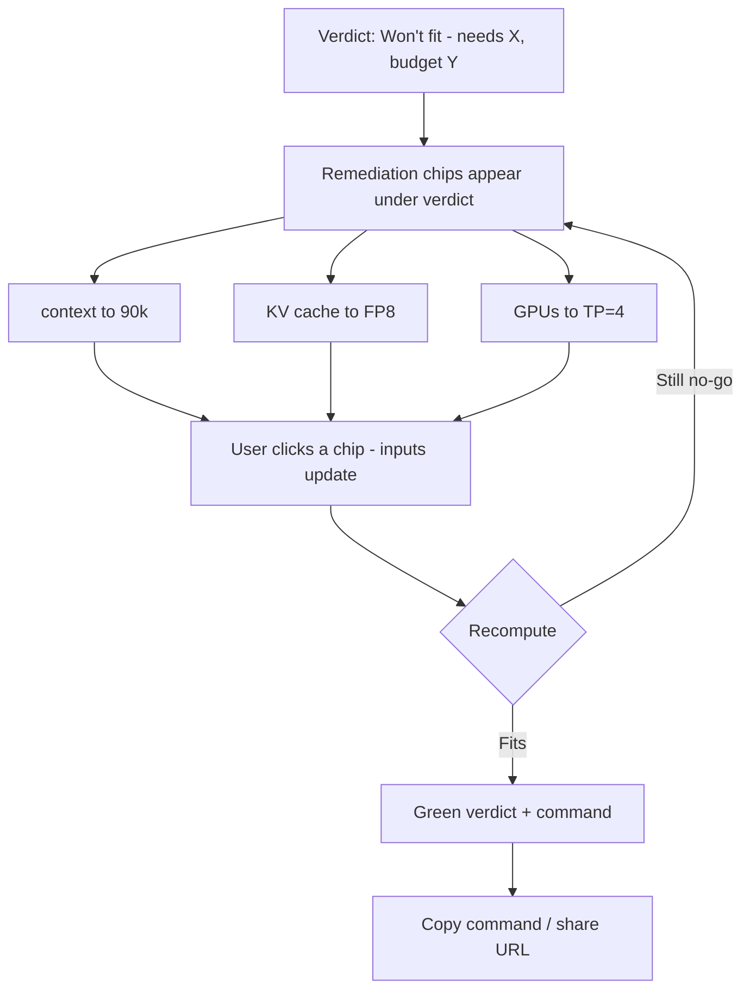
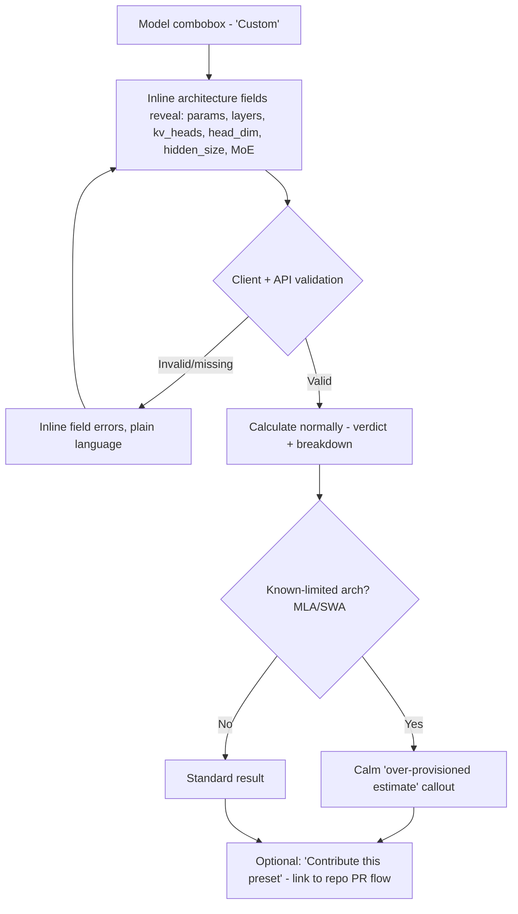

# UX Design Specification vllm-calc

**Author:** Simon
**Date:** 2026-07-08

---

<!-- UX design content will be appended sequentially through collaborative workflow steps -->

## Executive Summary

### Project Vision
vllm-calc is a single-screen, live-updating VRAM calculator that tells vLLM users whether a model configuration fits their GPUs — and if not, how to make it fit — then hands them a runnable `vllm serve` command. The UX exists to make an anxious, error-prone trial-and-error task feel like a calm, one-shot, trustworthy answer.

### Target Users
- **Primary — the multi-GPU serving engineer:** technical, time-pressured, and skeptical of numbers they can't verify. Sizing 70B/MoE deployments across 2–8 GPUs. Wants all the knobs *and* an instant, legible verdict. Works on a desktop browser (and via CLI in CI).
- **Secondary:** solo/single-GPU engineers; hardware/cost planners; newcomers using the transparent breakdown to *learn* why VRAM is consumed.

### Key Design Challenges
- **Input density vs. verdict clarity:** ~8 inputs plus advanced levers must not bury the result; the verdict is the visual anchor.
- **Trust through transparency:** the go/no-go and capacity sentence must be central and believable — the breakdown must show its work (expandable overhead terms, calibrated-vLLM-version label).
- **Perceived liveness under debounced calls:** ~200–300ms result latency must feel instant, never stale or flickering.
- **Accessible state encoding:** fit/no-fit conveyed by icon + text + color, never color alone (WCAG 2.1 AA, NFR17).

### Design Opportunities
- **Remediation as the hero interaction:** on a no-go, present nearest-fitting configs as one-click "apply" chips — the tool's most delightful and shareable moment.
- **Breakdown-as-teaching-tool:** an expandable stacked VRAM bar (weights / KV / overhead vs. budget) that doubles as an explainer, differentiating on legibility.
- **Shareable URL state:** every configuration encodes to a link — a UX convenience and an organic growth loop.

## Core User Experience

### Defining Experience
The product is **one continuous loop on a single screen**: *adjust an input → watch the VRAM breakdown and verdict update live → read the plain-language answer → (if no-go) apply a fix → copy the command.* There is no navigation, no wizard, no submit button. The user is always looking at inputs on one side and a living answer on the other. The defining interaction is **"turn a knob, see the truth"** — the verdict and the stacked bar respond as if the user were dragging a physical dial.

### Platform Strategy
- **Desktop-web-first**, mouse/keyboard. The primary persona sizes deployments at a workstation; dense controls + a wide breakdown bar want horizontal space. Fully responsive down to tablet, usable (read-mostly) on phone, but not phone-optimized in v1.
- **No install, no login, instant load** (NFR6). Static SPA + debounced API.
- **Offline/self-host parity:** identical UI whether pointed at the public API or a local Docker backend.
- **Keyboard-first:** every input tabbable; the generated command copyable via a single focusable action.

### Effortless Interactions
- **Presets do the heavy lifting:** picking "Llama-3.3-70B" and "A100 80GB ×2" auto-fills all the architecture params — the user never hand-enters `kv_heads` unless they *want* a custom model.
- **Live recompute:** no "Calculate" button — results follow input within ~300ms, with a subtle in-place refresh (never a full-screen spinner, never a stale number without a loading hint).
- **One-click remediation:** on a no-go, fixes are tappable chips — apply reshapes the inputs and recomputes instantly.
- **One-click copy** of the `vllm serve` command, with a confirmation micro-affordance.
- **Shareable by default:** the URL always reflects current inputs; copying the address bar shares the exact scenario.

### Critical Success Moments
- **The verdict reveal** — the instant "✅ Fits — supports up to 41 concurrent" or "❌ Won't fit" lands. This must be unmissable and instantly legible; it's the product's whole promise.
- **The remediation save** — a no-go turning into a green path *without a failed launch*. This is the moment users tell colleagues about.
- **First-time trust** — a skeptical engineer expands the overhead breakdown, sees it reconcile with what vLLM actually reserves (version-labeled), and decides to believe the number. Make-or-break for adoption.
- **The failure to avoid:** an ambiguous or stale result — a number showing while inputs have changed, or a red/green with no text. That single moment of doubt kills trust.

### Experience Principles
1. **The answer is the interface.** The verdict + breakdown are the visual center of gravity; inputs orbit it.
2. **Show your work.** Every number is inspectable (expandable overhead, version label) — transparency *is* the trust mechanism.
3. **Never just say no.** A no-go always comes with a way forward.
4. **Live, never laggy or lying.** Results feel instant and always match current inputs; loading is honest and in-place.
5. **Effortless for novices, complete for experts.** Presets make the simple path one-click; every advanced lever is one disclosure away.

## Desired Emotional Response

### Primary Emotional Goals
The dominant feeling is **calm confidence** — the relief of *knowing* before committing, replacing the low-grade dread of "let's launch it and see if it OOMs." Where the status quo is anxious trial-and-error, vllm-calc should feel like a **trusted expert colleague** who gives you a straight, verifiable answer. The feeling worth telling a friend about: *"it just told me exactly what would fit — and it was right."*

### Emotional Journey Mapping
- **Discovery:** *intrigued but skeptical* — "another VRAM calculator?" We must convert skepticism fast with a visibly-honest breakdown and a version-labeled number.
- **First calculation:** *pleasantly surprised* — presets auto-fill, the answer appears instantly, no setup friction.
- **The verdict:** *relief (✅) or clarity, not dread (❌)* — even a "no" should feel like useful news, not a dead end.
- **Remediation:** *rescued and in-control* — "oh, I just need FP8 or one more GPU." The anxiety converts to agency.
- **Copying the command:** *momentum* — armed and ready, no second-guessing.
- **When something's uncertain (MLA/over-provision flag):** *respected* — the tool is honest about its limits rather than falsely confident.
- **Return visit:** *reliance* — this is now the reflexive first step before any deployment.

### Micro-Emotions
The make-or-break axes for this product:
- **Trust vs. Skepticism** — *the* central battle; won through transparency and verifiable accuracy.
- **Confidence vs. Confusion** — dense inputs must never induce "am I doing this right?"
- **Accomplishment vs. Frustration** — a no-go must route to accomplishment via remediation, never a dead-end frustration.
- **Respected vs. Misled** — honest flags over confident-but-wrong numbers.

### Design Implications
- **Trust → transparency:** expandable breakdown, the exact `vllm serve` command, and a visible "calibrated for vLLM vX.Y" label. Show the math; don't ask for faith.
- **Calm confidence → visual hierarchy:** the verdict is large, central, and unambiguous; inputs are quiet and orderly. No clutter competing with the answer.
- **Rescued → remediation chips:** a no-go immediately offers tappable, applyable fixes — the emotional pivot from stuck to moving.
- **Respected → honest states:** over-provision/unsupported cases get a clear, non-alarming caveat, not a hidden asterisk.
- **Confidence → liveness done right:** in-place, flicker-free updates; a number never contradicts the inputs on screen.
- **Avoid anxiety:** no full-screen spinners, no jarring red flashes, no dead-ends, no unexplained numbers.

### Emotional Design Principles
1. **Relief over reassurance** — earn calm by being *right and verifiable*, not by soothing copy.
2. **Honesty is the feature** — the tool that admits its limits is the tool you trust with the hard calls.
3. **A "no" is a helpful "not yet"** — never leave the user stuck.
4. **Quiet inputs, loud answer** — emotional weight belongs on the verdict.
5. **Respect the expert** — never dumb it down or hide the math; confidence comes from seeing it.

## UX Pattern Analysis & Inspiration

### Inspiring Products Analysis
- **crontab.guru** — the gold standard for "show your work." You type a cron expression; it *instantly* renders a plain-language explanation. Zero chrome, zero login, one job done perfectly. Directly parallels our input → plain-language verdict.
- **regex101 / RegExr** — live matching + a *side panel that explains every token*. Proves a dense, expert tool can teach while it works — our "breakdown-as-teaching-tool" ambition.
- **Tailwind Play / Excalidraw** — instant, no-install, and **state lives in the URL** so any scenario is shareable by pasting a link. Our shareable-URL growth loop, already validated.
- **Cloud pricing calculators (Vercel/Railway config views)** — config knobs → a live number. Succeed at instant feedback; often *fail* at opaque math with no explanation — an anti-pattern we reject.
- **Stripe API explorer / docs** — generated, copy-ready code snippets with a satisfying copy affordance. Our `vllm serve` command panel should feel this polished.

### Transferable UX Patterns
- **Live input → instant explained result** (crontab.guru, regex101) → knob→verdict loop with an inspectable breakdown.
- **Explain-alongside panel** (regex101) → expandable overhead terms + version label as a teaching surface.
- **URL-as-state** (Tailwind Play, Excalidraw) → shareable scenarios from day one.
- **Copy-with-confirmation** (Stripe) → the command panel.
- **Preset → autofill** (design-token pickers, cloud instance selectors) → model/GPU presets fill architecture params.

### Anti-Patterns to Avoid
- **Opaque "trust me" numbers** (many pricing calculators) — conflicts with the trust thesis; we always show the math.
- **Modal/multi-step wizards** for what is one screen — kills the live loop and the sense of play.
- **Full-screen spinners / layout jumps** on recompute — breaks perceived liveness and calm.
- **Color-only status** — fails accessibility + legibility; we pair color with icon + text.
- **Dead-end errors** ("won't fit," full stop) — we always route to remediation.
- **Forced login/onboarding** before the first answer — destroys instant-value and the no-friction promise.

### Design Inspiration Strategy
- **Adopt:** crontab.guru's radical focus (one screen, instant explained answer); regex101's explain-panel; Tailwind Play's URL-state; Stripe's copy affordance.
- **Adapt:** the pricing-calculator config→number loop, but make the number *transparent and remediating* — the exact gap incumbents leave open.
- **Avoid:** opacity, wizards, spinners, color-only status, dead-ends, gated onboarding.

## Design System Foundation

### Design System Choice
**Themeable foundation: Tailwind CSS + Radix UI primitives (the shadcn/ui pattern).** Utility-first styling (Tailwind) for a clean, neutral developer-tool aesthetic we fully control, layered over Radix UI headless primitives for the interactive bits (select/combobox for presets, disclosure for advanced levers & overhead expansion, tooltip, dialog). Components are **copied into the repo** (shadcn/ui style), not pulled from a locked component library.

### Rationale for Selection
- **Accessibility for free (NFR17):** Radix primitives ship correct keyboard nav, focus management, and ARIA — the hardest part of the WCAG 2.1 AA target, solved by the foundation rather than hand-built.
- **Control + boring tech:** Tailwind is stable, ubiquitous, and gives total visual control without inventing a bespoke system — matches the architecture's "minimal composed, no magic" and "boring technology" stance.
- **Small dependency surface:** copy-in components mean no heavyweight runtime library, no version lock-in, easy for OSS contributors to read and extend — aligns with the self-host/air-gapped and contributor-friendly goals.
- **Right aesthetic:** neutral, dense-but-clean, "IDE-adjacent" — fits the skeptical-expert persona better than a consumer-flavored library would.
- **The hero viz stays custom:** the stacked VRAM bar is bespoke SVG/CSS (per architecture) — the design system dresses the *inputs and chrome*, not the centerpiece.

**Rejected:** MUI/Chakra/Ant (heavier bundle, opinionated look, less control, more to override); fully-custom design system (too much investment for a focused tool + small team).

### Implementation Approach
- Tailwind config defines **design tokens** (color scale, spacing, typography, radii); a small set of shadcn/ui-style components (`Select`, `Combobox`, `Disclosure/Accordion`, `Tooltip`, `Button`, `Tabs`, `Callout`) copied into `web/src/components/`.
- **Light + dark themes** via CSS variables / Tailwind dark mode (developer audience strongly expects dark mode).
- Semantic status tokens for the verdict — `fit`, `no-fit`, `warn/over-provision` — each pairing a color **with** an icon + label (never color alone).

### Customization Strategy
- A neutral, restrained base palette with a single accent; **status colors carry meaning, not decoration**. Typography favors a clear UI font + a monospace face for the generated command and numeric values.
- The VRAM stacked bar gets its own small, accessible categorical palette (weights / KV / overhead) chosen for contrast and colorblind-safety — following data-viz best practice when the visualization is detailed.
- Tokens centralized so the whole tool can be re-themed (and so an embeddable-widget future stays feasible).

## 2. Core User Experience

### 2.1 Defining Experience
**"Turn a knob, see the truth."** The user changes one input — bumps context length, adds a GPU, switches quantization — and the VRAM breakdown bar and verdict re-settle within a heartbeat, no button, no reload. If a friend asks what it does: *"you set your GPU and model, and it tells you live whether it'll fit — and if not, exactly how to make it fit."* Nailing this live, honest, remediating loop makes everything else (presets, command generation, sharing) follow naturally.

### 2.2 User Mental Model
- **Today's model:** "I edit a launch command, run `vllm serve`, and wait to see if it OOMs." Users think in vLLM flags (`--tensor-parallel-size`, `--max-model-len`, `--gpu-memory-utilization`) and GPU counts.
- **Expectation they bring:** a config form that produces a *number and a yes/no* — like a pricing or GGUF calculator — but they *distrust* those numbers because they've been burned.
- **The bridge:** speak their language (vLLM flags map 1:1 to inputs; the output *is* a `vllm serve` command), then exceed expectations by (a) showing the math and (b) not just judging but *fixing*.
- **Existing-tool frustrations we meet head-on:** opaque numbers, no TP handling, no serving-capacity answer, no command.

### 2.3 Success Criteria
- **"This just works":** first meaningful result with **zero setup** — pick two presets, the answer is already there.
- **Feels instant:** perceptible result within ~300ms of an input change; never a blocking spinner.
- **Feels smart:** the capacity sentence ("supports up to 47") answers the question they didn't know how to phrase.
- **Trusted enough to act on:** the user copies the command / provisions hardware *without a test launch*.
- **Rescued on failure:** a no-go reaches a working config in one or two clicks.

### 2.4 Novel vs. Established Patterns
Mostly **established patterns in a fresh combination** — low learning curve, right for a skeptical expert:
- *Established:* live config→result, preset selectors, expand/disclose, copy-to-clipboard, URL-state.
- *The fresh twist:* (1) **remediation chips** — "won't fit → fits at 90k / FP8 / TP=4" as one-click applies — the novel, delightful bit; (2) the **breakdown-as-explainer** stacked bar that teaches while it judges. No user education needed; both read as obvious once seen.

### 2.5 Experience Mechanics
**1. Initiation** — The screen loads with a sensible default scenario already computed (a popular model on a common GPU), so the user sees a working example immediately, then edits from there. Inputs grouped: *Model*, *GPU & Parallelism*, *Workload* (context, concurrency, gpu-util), and a collapsed *Advanced* (max-num-batched-tokens, enforce-eager, kv-cache dtype).
**2. Interaction** — The user selects a preset (combobox) or edits a field. Each change debounces (~250ms) and fires one `/v1/calculate` call. Selecting a model/GPU preset autofills its architecture fields (editable, marked "from preset"). Custom-model entry reveals the architecture fields inline.
**3. Feedback** —
   - The **verdict banner** (top of the result region) updates: ✅ *"Fits — supports up to 41 concurrent"* / ❌ *"Won't fit — needs ~104 GB/GPU, budget 72 GB"* — always icon + text + color.
   - The **stacked VRAM bar** re-animates its segments (weights / KV / overhead) against the budget line; overhead expandable into its three terms.
   - During recompute: a subtle in-place "updating" shimmer on changed values only — never blanks out, never blocks; last valid result stays visible until the new one lands (no stale *unlabeled* number).
   - On a no-go: **remediation chips** appear directly under the verdict.
   - Honesty flags (MLA/over-provision, unsupported) render as an inline callout, calm not alarming; a "calibrated for vLLM vX.Y" label sits near the verdict.
**4. Completion** — No hard "done"; the natural endpoint is **copying the generated `vllm serve` command** (with a "copied ✓" micro-confirmation) or **copying the URL** to share. Both always available once a result exists.
**Error/edge:** invalid parallelism (TP doesn't divide heads, TP≠GPU count) surfaces inline on the offending field with a plain-language reason; the KV-replication-wall warning appears as a non-blocking caution, not an error.

## Visual Design Foundation

### Color System
A **restrained, neutral base with a single calm accent** — the interface should feel like a well-made developer tool, letting the *verdict and the data* carry the color.
- **Neutrals:** a full gray scale (slate/zinc family) for surfaces, borders, text. **Dark theme is the default** (developer expectation), light theme fully supported, both via CSS variables.
- **Accent (single):** a calm blue/indigo for interactive affordances (focus rings, selected preset, links) — trustworthy, not attention-grabbing.
- **Semantic status (meaning, not decoration), each paired with an icon + label so it's never color-alone (NFR17):** `fit` → green (✓); `no-fit` → red (✗); `warn / over-provision` → amber (⚠, for MLA/SWA/replication-wall notes).
- **VRAM stacked-bar categorical palette** (weights / KV cache / overhead): three hues chosen for **colorblind-safe contrast** and distinctness in both themes, with the "budget line" as a distinct neutral marker. Exact values finalized against data-viz contrast rules when the bar is detailed.
- All text/background pairings target **WCAG AA (4.5:1)**; status colors verified in light + dark.

### Typography System
- **Tone:** precise, technical, calm — professional without being sterile.
- **UI typeface:** a clean, highly-legible sans (e.g. Inter or the system UI stack) for labels, controls, and the verdict.
- **Monospace typeface:** for the generated `vllm serve` command, numeric VRAM values, and architecture params — reinforces "exact / machine-truthful" and aids number scanning.
- **Type scale (modest, ~1.25 ratio):** one prominent size for the **verdict**, clear step-down for section labels, comfortable body, small caption for provenance/version labels. Breakdown numbers slightly heavier for scanability.
- Line-height generous on explanatory text (teaching moments), tight on dense control labels.

### Spacing & Layout Foundation
- **4px base unit**, 8px rhythm — dense enough for an expert control panel, breathable enough to stay calm.
- **Two-region layout on desktop:** inputs left (grouped: Model / GPU & Parallelism / Workload / Advanced-collapsed), **result region right** (verdict banner → stacked bar → remediation → command) as the visual anchor. Collapses to stacked (inputs above result) on narrow/tablet.
- **Whitespace signals hierarchy:** the verdict region gets the most breathing room; input groups are compact cards; the result region is subtly elevated to read as "the answer."

### Accessibility Considerations
- WCAG 2.1 AA: keyboard-navigable throughout (Radix primitives), visible focus rings, AA contrast in both themes.
- **No color-only meaning** — fit/warn/no-fit always carry icon + text.
- The stacked bar exposes values as text/labels (not just visual segments) and works for colorblind users (palette + labels).
- Respects `prefers-reduced-motion` — recompute shimmer and bar animation degrade to instant.
- Live result updates announced via a polite ARIA live region so the verdict change is perceivable non-visually.

## Design Direction Decision

### Design Directions Explored
Three interactive mockups were produced (`docs/ux-design-directions.html`, both themes, shared tokens, identical scenario):
- **01 — Control Panel:** inputs left / living answer right (workstation density). Best for power users; matches the spec's two-region layout. Risk: busy for newcomers.
- **02 — Verdict-First:** oversized hero verdict on top, inputs as quiet pills, remediation chips prominent. Best for converting skeptics + the remediation moment. Risk: fewer knobs on-screen for experts.
- **03 — Inspector:** IDE-style three-pane with an always-open "show your work" math panel. Best for first-time trust. Risk: widest layout, needs horizontal room.

### Chosen Direction
**Hybrid anchored on 01 (Control Panel), incorporating 02's oversized verdict + one-click remediation chips, with 03's "show your work" delivered as the expandable-overhead disclosure (on demand) rather than a permanent third pane.**

### Design Rationale
- **01 base** gives the expert persona the density and all-knobs-visible workstation feel the spec calls for (two-region layout).
- **02's loud verdict + remediation chips** enforce "the answer is the interface" and "never just say no" — the emotional core and the most shareable moment.
- **03's math, on expand** honors "show your work" and the first-time-trust moment without spending permanent horizontal space or overwhelming newcomers — matching "quiet inputs, loud answer" and "complete for experts, effortless for novices."

### Implementation Approach
Two-region responsive layout (inputs left, result right; stacks on tablet/mobile). Result region order: verdict banner → stacked VRAM bar (overhead expandable into its 3 terms = the "show your work" surface) → remediation chips (on no-go) → generated command. Built with the Tailwind + Radix (shadcn/ui) foundation and the slate/indigo + reserved-status token system. VRAM-bar hues (indigo/teal/slate) pending formal colorblind-contrast validation before build.

## User Journey Flows

### Journey A — First Calculation (happy path)
Entry: user lands on the page; a **default scenario is already computed** (no empty state). They swap in their real model/GPU and read the verdict.

### Journey B — No-Go to Remediation (the hero moment)
Entry: any calculation returns a no-go. The point is to convert *stuck* into *moving* with zero failed launches.

### Journey C — Custom Model Entry
Entry: the model isn't in presets. User supplies architecture params directly; may then contribute it.

### Journey Patterns
- **Live-recompute pattern:** every input change → debounce → single `/calculate` → in-place result update with last-valid-result persistence (A, B, C).
- **Autofill-with-provenance pattern:** selecting a preset fills fields tagged "from preset," still editable (A, C).
- **Apply-and-recompute pattern:** remediation chips and preset picks both mutate inputs then re-run the same recompute path (B) — one mechanism, reused.
- **Honest-flag pattern:** results that are calculable-but-limited render a calm inline callout, never an error/block (C).
- **Inline-validation pattern:** constraint failures (TP divisibility, missing custom fields) surface on the offending field, never a global error banner.

### Flow Optimization Principles
- **Zero steps to first value** — pre-computed default; no blank form.
- **Every failure has a forward path** — no-go always yields chips; invalid input always says how to fix it.
- **One recompute path** — A, B, and C converge on the same debounced `/calculate` → in-place-update flow (fewer states, guaranteed consistency).
- **Progress is felt, not narrated** — in-place shimmer on changed values; no wizard steps, no progress bars.
- **Reversibility** — every applied remediation/preset is just another input change (undo = change it back); URL state makes any point shareable/restorable.
- **CLI/CI journey (Journey 3, non-screen):** terminal-driven via `vllm-calc check …` → same engine, machine-readable `--json`, non-zero exit on no-go; no UI flow.

## Component Strategy

### Design System Components
From the **Tailwind + Radix (shadcn/ui)** foundation, used mostly as-is (styled with our tokens):
- **Combobox / Select** — model & GPU preset pickers (searchable, keyboard-navigable).
- **Input / NumberField** — context length, concurrency, gpu-util, custom architecture params.
- **Accordion / Disclosure** — the "Advanced" input group and the expandable overhead terms.
- **Tooltip / Popover** — inline explanations on inputs and breakdown segments.
- **Button** — copy actions, chip base.
- **Callout / Alert** — honesty flags and inline validation.
- **Toast** — "copied ✓" confirmations.
- **Theme toggle** — light/dark switch.

### Custom Components
Two components carry the product's identity and must be built custom:

**`VramBreakdownBar` (the hero)**
- **Purpose:** show per-GPU weights / KV / overhead against the usable budget at a glance.
- **Content:** three stacked segments (bytes→GiB at the edge), a budget marker line, legend with values.
- **Actions:** hover a segment → tooltip with exact value + %; expand the overhead segment → its three sub-terms ("show your work").
- **States:** fits · over-budget (segments cross the budget line, emphasized) · updating (in-place shimmer) · flagged (over-provision caveat attached).
- **Variants:** compact (inline) vs. expanded (sub-terms); single-GPU vs. per-GPU (TP) label.
- **Accessibility:** `role="img"` with a full-sentence `aria-label`; screen-reader table alternative; colorblind-safe hues + text labels; respects reduced-motion.

**`VerdictBanner` (the answer)**
- **Purpose:** deliver the go/no-go + capacity sentence as the visual center of gravity.
- **Content:** icon (✓/✗) + headline + subline; calibrated-vLLM-version label.
- **Actions:** hosts `RemediationChips` on a no-go.
- **States:** fit · no-go · warn/over-provision · updating.
- **Accessibility:** icon + text + color (never color alone); wrapped in a polite ARIA live region so verdict changes are announced.

Plus two smaller custom pieces built from foundation primitives:
- **`RemediationChips`** — applyable "fits at 90k / FP8 / TP=4" chips (each carries the input delta it applies).
- **`CommandBlock`** — monospace `vllm serve` output with syntax-tinted flags and a copy affordance.

### Component Implementation Strategy
- Build all custom components on **design-system tokens** so they theme automatically in light/dark.
- Keep them **presentational + controlled** — render from the `/calculate` result object, emit input-change events; no calc logic in components (parity + testability).
- Each custom component gets **vitest** coverage and an accessibility check (roles, keyboard, contrast).
- `VramBreakdownBar` follows data-viz mark specs (2px segment gaps, rounded data-ends, direct value labels); its palette is validated before build.

### Implementation Roadmap
- **Phase 1 — Core (critical path):** `VerdictBanner`, `VramBreakdownBar`, input controls (Combobox/NumberField), `CommandBlock` — makes Journey A end-to-end.
- **Phase 2 — Supporting:** `RemediationChips` (Journey B), `Callout` honesty flags + inline validation (Journey C), overhead expand ("show your work").
- **Phase 3 — Enhancement:** theme toggle polish, tooltips/explanations, toast confirmations, URL-state sync, reduced-motion/ARIA-live refinements.

## UX Consistency Patterns

### Button Hierarchy
- **Primary:** solid accent (indigo) — the *one* main action in a context (e.g. **Copy command**). At most one per region.
- **Secondary:** outlined/subtle — copy URL, expand, reset.
- **Remediation chips:** distinct tertiary style (monospace, bordered, hover→accent) — clearly "apply this change," visually separate so they read as suggestions, not commands.
- **Icon buttons** (copy, theme toggle) always carry an accessible label + tooltip; never icon-only for SR users.
- Every button states exactly what happens ("Copy", then toast "Copied"); no vague "OK/Submit."

### Feedback Patterns
- **Verdict feedback** (core): banner with icon + text + color — fit (green ✓), no-go (red ✗), over-provision (amber ⚠). Always all three channels, never color-only.
- **Recompute feedback:** in-place shimmer on changed values only; last valid result persists; **no full-screen spinners, no layout shift.** If a call is slow (>~1s), a subtle "updating…" hint appears near the verdict.
- **Copy feedback:** transient toast "Copied ✓" (~2s), also announced via ARIA live.
- **Honesty callouts** (MLA/SWA/unsupported): calm amber `Callout`, informative not alarming, inline near the affected result.
- **No dead-ends:** every error/no-go includes the next action.

### Form / Input Patterns
- **Live, no submit button** — inputs recompute on change (debounced); the app has no "Calculate" button by design.
- **Presets over typing** — default to a searchable preset; custom entry is a deliberate opt-in revealing fields inline. Preset-derived fields tagged "from preset," still editable.
- **Inline validation, on the field** — plain-language, at the offending input (e.g. "TP=3 doesn't divide the KV heads evenly"), never a global banner; last valid result stays on screen while an input is invalid.
- **Sensible units + affordances** — numeric fields show units, use `tabular-nums`, accept human-friendly entry (e.g. "32k"); gpu-util as 0–1/% with a clear control.
- **Grouped + progressively disclosed** — Model / GPU & Parallelism / Workload always visible; Advanced collapsed by default.

### Navigation Patterns
- **Single screen, no nav** — no pages to navigate; "navigation" is *disclosure* (expand overhead, open Advanced) and *state in the URL*.
- **URL as canonical state** — every input change updates the query string (debounced); back/forward and refresh restore the exact scenario; copying the URL shares it. No separate share modal in v1.
- **Focus order** follows reading order: inputs (grouped) → result → command; skip-to-result affordance for keyboard users.

### Additional Patterns
- **Loading / initial state:** never blank — boots with a pre-computed default scenario; first paint shows a real result.
- **Empty/custom state:** choosing "Custom model" reveals a clearly-scoped field group with helper text, not a wall of inputs.
- **Motion:** subtle, functional (segment transitions, shimmer); all gated by `prefers-reduced-motion`.
- **Numbers** use monospace + `tabular-nums` so values don't jitter as they update.

### Design-System Integration
Enforced through the shadcn/ui token layer: button variants → Button styles; callouts/toasts → Alert/Toast; validation → field-level error slots; verdict/bar are the two custom components. Custom rules: (1) exactly one primary action per region; (2) status = color **+ icon + text**, always; (3) result updates are in-place, never blocking; (4) no submit buttons anywhere.

## Responsive Design & Accessibility

### Responsive Strategy
Desktop-first (the primary persona's context), gracefully degrading — never a separate mobile product.
- **Desktop (≥1024px):** the full two-region layout — inputs left, result right — with the VRAM bar at comfortable width and overhead expandable inline. Extra space goes to breathing room around the verdict, not more chrome.
- **Tablet (768–1023px):** regions **stack** — inputs above, result below — each full-width; input groups may go two-up. Touch targets enlarge; comboboxes become touch-friendly. Fully usable for real work.
- **Mobile (<768px):** single column, read-optimized. Inputs collapse into compact groups (Advanced stays collapsed); the **verdict + bar are pinned prominent** so the answer is seen first. The `vllm serve` command scrolls horizontally in its own container (never widens the page). Not the primary target, but never broken.

### Breakpoint Strategy
- **Tailwind defaults, mobile-first media queries:** `sm 640` / `md 768` / `lg 1024` / `xl 1280`. Two-region layout engages at **`lg`**; below that, stack.
- Relative units throughout (`rem`, `%`, `ch`, `vw`); the result region has a max width so line lengths and the bar stay readable on ultrawide.
- Product-specific: the **VRAM bar keeps segment labels legible** — below a threshold, labels move from inline to the legend beneath.

### Accessibility Strategy
Target **WCAG 2.1 AA** (per NFR17):
- **Contrast:** ≥4.5:1 text / ≥3:1 UI + large text, verified in **both** themes; status hues checked on their backgrounds.
- **Never color-alone:** fit/no-go/warn always icon + text + color; VRAM segments carry text labels and a screen-reader table alternative.
- **Keyboard:** full operability (Radix primitives), logical focus order, visible focus rings, a **skip-to-result** link.
- **Screen readers:** semantic HTML + ARIA; the verdict lives in a **polite ARIA live region** so recompute results are announced; the bar exposes an `aria-label` sentence + table.
- **Touch targets:** ≥44×44px on touch.
- **Motion:** honor `prefers-reduced-motion` (shimmer/segment transitions → instant).
- **Zoom/reflow:** usable at 200% zoom without horizontal page scroll.

### Testing Strategy
- **Automated (CI):** axe-core in vitest/Playwright on key states (fit, no-go, custom, flagged); Lighthouse a11y budget; contrast checks on the token palette both themes; the data-viz palette run through the colorblind validator.
- **Responsive:** Playwright viewport matrix (mobile/tablet/desktop/ultrawide) across Chromium/Firefox/WebKit; verify no horizontal page scroll and the command block scrolls internally.
- **Manual:** keyboard-only pass of all three journeys; screen-reader smoke test (VoiceOver + NVDA) on verdict announcements and the bar's table; colorblind simulation of the bar; 200% zoom pass.

### Implementation Guidelines
- **Responsive dev:** mobile-first Tailwind classes; relative units; `overflow-x:auto` wrappers for the command block and wide content; test touch targets at `md` and below.
- **A11y dev:** semantic landmarks (`main`, grouped `fieldset`/`legend` for input groups); label every control; `aria-live="polite"` on the result region; `role="img"` + descriptive label on the bar plus a visually-hidden data table; manage focus when custom-model fields reveal; theme toggle persists and both themes pass contrast.
- **Numbers:** `font-variant-numeric: tabular-nums` on all value displays so live updates don't shift layout.
